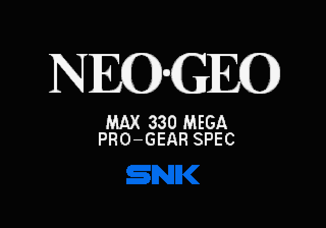
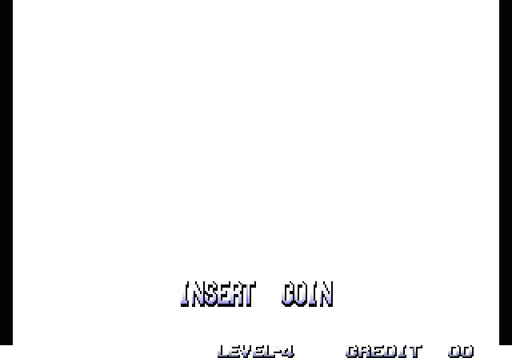
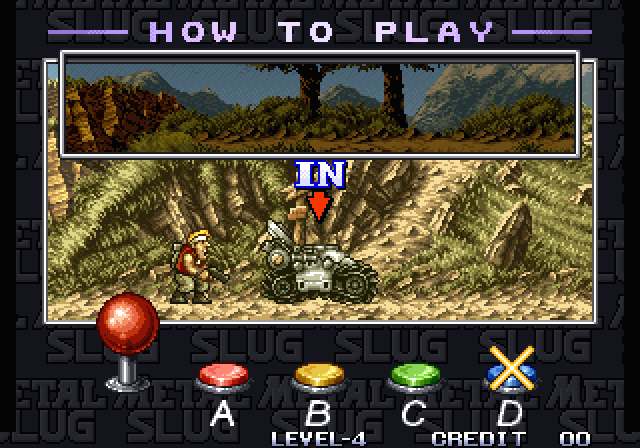
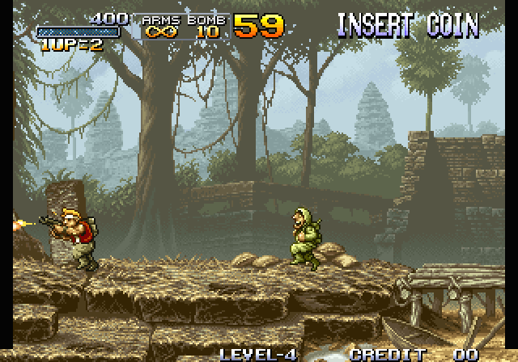
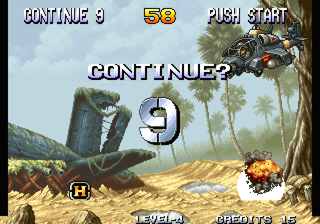

# Metal Slug: static recompilation

**Metal Slug (Nazca/SNK, 1996) running as a native PC program: its 68000 code is recompiled to C and runs on the [neogeorecomp](https://github.com/sp00nznet/neogeorecomp) board model.**

This is the reference game for neogeorecomp. The toolkit does all the work; this repo describes the ROM set and builds the game.

> **No game data here.** You need your own Metal Slug and Neo Geo system ROM dumps (MAME sets `mslug` and `neogeo`). The recompiled C is generated from your dump on your machine, into `build/`. It is never committed or distributed, and neither is anything else derived from the ROMs.

## Status

**v0.1.0-dev, alpha.** Metal Slug boots, runs attract mode, takes a coin and plays Mission 1 on recompiled code. **There is no sound yet.**

- Boot through the real MVS system ROM → eyecatcher → title → How to Play → Mission 1, with continues.
- A 5-minute scripted soak runs **100% natively** (0 interpreted instructions) after the profile pass, and `--verify` checks **14.06M** recompiled blocks against the Musashi interpreter with **0 mismatches**.
- Frame output is identical to the interpreter's, byte for byte, and identical between Windows and Linux builds.
- Not yet: sound, later missions checked by script, gamepad support, and a settings menu.

## Screenshots

All real output from the recompiled build (`--headless --screenshot`):

| | |
|---|---|
|  |  |
|  |  |
|  |  |

## Getting started

### Quick start (Windows)

1. Download this repo: **Code → Download ZIP**, then unzip it. A `git clone` works too.
2. Put your **`mslug.zip`** and **`neogeo.zip`** (MAME sets) in the unzipped folder, or in `Downloads`.
3. Double-click **`Setup.cmd`**.

   It checks for Git, CMake, the Visual Studio C++ build tools and SDL2, and asks before installing anything that's missing (it says what and how big). It finds and checksums your ROMs, recompiles and builds the game (a few minutes), and leaves a **Metal Slug** launcher in the folder. If something fails, it stops with one sentence on what to do and keeps the details in `setup.log`. Running it again picks up where it stopped.
4. Double-click **Metal Slug**.

**On Linux**, run `./setup.sh` instead, optionally with `--rom-zip PATH --bios-zip PATH`. It does the same steps and offers the `apt` command for anything missing. When it finishes, run `./metalslug.sh`.

Keys: **arrows** move, **Z** shoot, **X** jump, **C** grenade, **5** insert coin, **1** start, **Esc** quit.

### Step by step

These are the commands `Setup.cmd` runs.

**Prerequisites:** Git; CMake 3.21+; a C compiler (Visual Studio 2022 with *Desktop development with C++* on Windows, or gcc on Linux); SDL2 for the window (optional, since headless builds need nothing). On Linux: `sudo apt install git cmake gcc libsdl2-dev`.

1. **Clone with the toolkit submodule:**
   ```
   git clone --recurse-submodules https://github.com/sp00nznet/metalslug
   cd metalslug
   ```
2. **Unzip your ROMs into `roms/`.** From `mslug.zip`: `201-p1.p1 201-s1.s1 201-m1.m1 201-c1.c1 201-c2.c2 201-c3.c3 201-c4.c4 201-v1.v1 201-v2.v2`. From `neogeo.zip`: `sp-s2.sp1 sfix.sfix sm1.sm1 000-lo.lo`. [docs/game-notes.md](docs/game-notes.md) lists the CRC32s.
3. **Configure.** On Windows, point CMake at SDL2: vcpkg's toolchain file, or `-DSDL2_DIR=<SDL2-devel-VC>/cmake`.
   ```
   cmake -S . -B build -DMSLUG_ROM_DIR=roms
   ```
4. **Build.** The generator recompiles your ROMs into `build/generated` first:
   ```
   cmake --build build --config Release
   ```
   Expected in the output:
   ```
   [m68krecomp] pointer scan: 10003 seeds
   [m68krecomp] mslug: 445072 instructions emitted across routines
   [m68krecomp] 15006 routines, 33423 dispatch entries -> .../build/generated
   ```
5. **Profile (optional).** This plays two scripted sessions headless to find code only reached at runtime, then rebuilds with it:
   ```
   cmake --build build --config Release --target profile
   cmake --build build --config Release
   ```
6. **Play:**
   ```
   build/Release/metalslug --rom-path roms          (Linux: build/metalslug)
   ```

Trip-ups:
- *`error: cannot open roms/201-p1.p1`*: the ROMs are not in `roms/`, or you are running from a different folder. Pass `--rom-path`.
- *"Submodules missing"*: you cloned without `--recurse-submodules`. Run `git submodule update --init --recursive`.
- *`python` or PATH trouble*: none of this needs Python. If a freshly installed tool isn't found, open a new terminal so it sees the updated PATH.
- *No window, and "built without SDL2; run with --headless"*: CMake didn't find SDL2 (see step 3).

## Usage

```
metalslug --rom-path roms                                  # play
metalslug --headless --frames 1900 --input tests/coin_start.txt --record run.mp4
metalslug --headless --verify --frames 1801 --input tests/coin_start.txt
metalslug --headless --interp --frames 1801 --screenshot 1800:interp.png
```

The toolkit's [docs/running.md](https://github.com/sp00nznet/neogeorecomp/blob/master/docs/running.md) covers every option and the input-script format. `tests/coin_start.txt` reaches Mission 1, and `tests/play_long.txt` is the 5-minute soak.

## Building from source

See *Step by step* above. `MSLUG_ROM_DIR` is the only game-specific option. Without it, the build is interpreter-only, which is useful for working on the toolkit without regenerating.

## Documentation

- [docs/game-notes.md](docs/game-notes.md): the ROM set and what the game needed from the toolkit
- [neogeorecomp](https://github.com/sp00nznet/neogeorecomp): the architecture and recompiler docs
- [CHANGELOG.md](CHANGELOG.md) · [ROADMAP.md](ROADMAP.md) · [CONTRIBUTING.md](CONTRIBUTING.md)

## Contributors

No outside contributions yet. [CONTRIBUTING.md](CONTRIBUTING.md) explains how to send one.

## License

The code in this repo is MIT ([LICENSE](LICENSE)). *Metal Slug* is © SNK; this project contains none of its code or data and needs your own dump to do anything.
